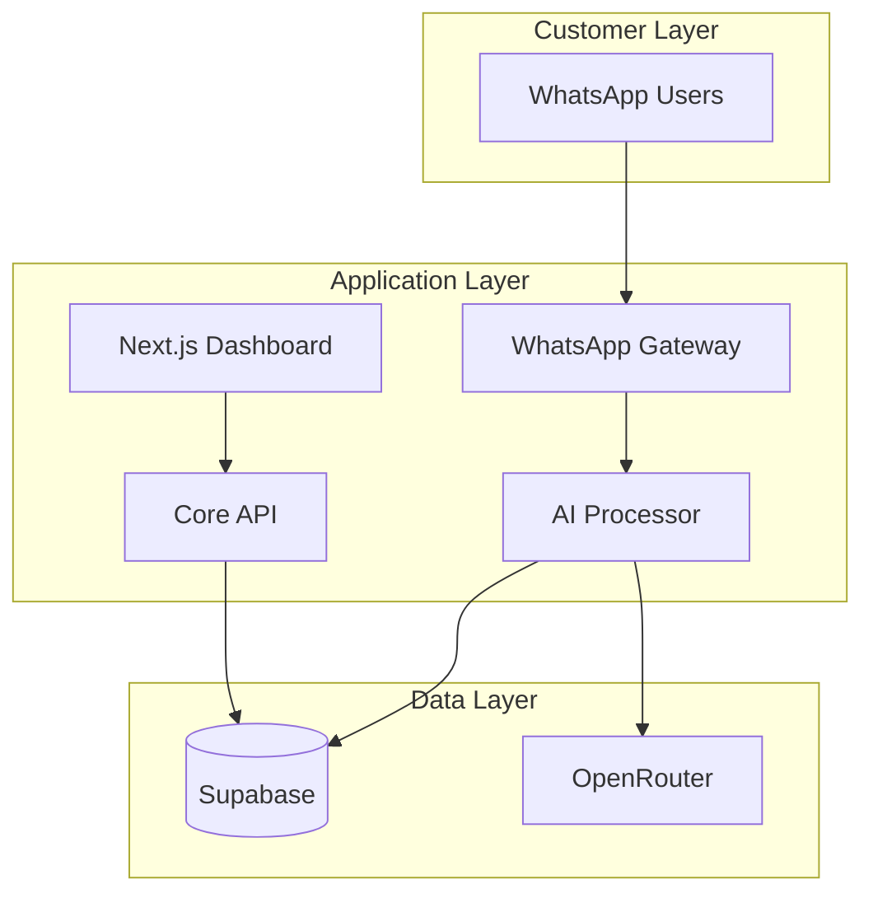
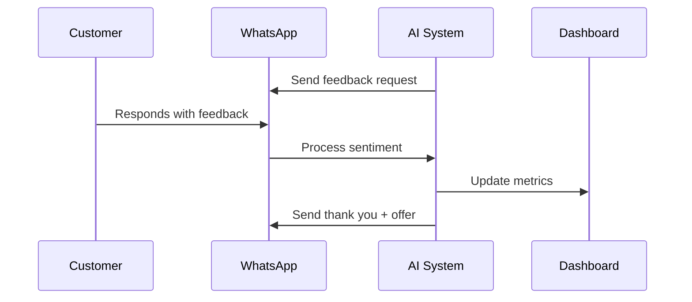
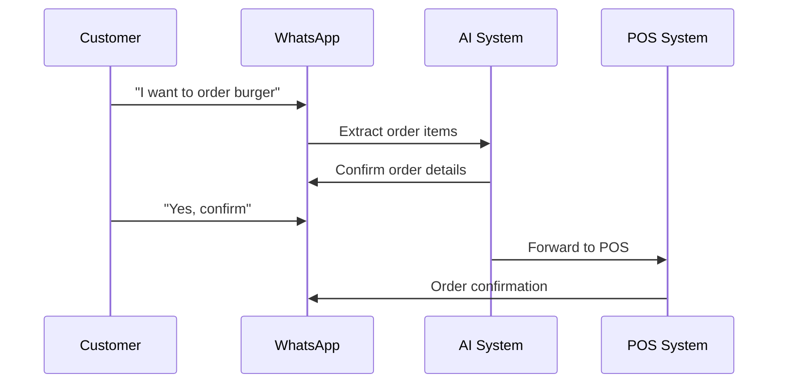

# CRM-RES 🏪💬

A culturally-intelligent WhatsApp automation platform designed specifically for Saudi Arabian restaurants. Transform your restaurant's customer engagement with AI-powered conversations that understand Arabic dialects, respect prayer times, and provide personalized experiences.

## 🌟 Features

- **🤖 AI-Powered Conversations**: Multi-model LLM integration via OpenRouter with Arabic language support
- **⏰ Prayer Time Intelligence**: Automatic message scheduling that respects Islamic prayer times
- **🎭 Cultural Personality Matching**: AI personalities adapted for Saudi cultural preferences
- **📊 Real-time Analytics**: Live dashboard with conversation metrics and sentiment analysis  
- **🏢 Multi-Branch Support**: Centralized management for restaurant chains
- **💬 WhatsApp Native**: Direct integration with WhatsApp Business Cloud API
- **🔄 Progressive Automation**: Start with feedback collection, expand to full ordering

## 🏗️ Architecture

### Tech Stack
- **Frontend**: Next.js 14, TypeScript, Tailwind CSS, Shadcn/ui
- **Backend**: Python 3.12, FastAPI, Docker containers
- **Database**: Supabase (PostgreSQL) with real-time subscriptions
- **AI**: OpenRouter API for multi-provider LLM access
- **Deployment**: AWS ECS Fargate, Vercel for frontend
- **Monorepo**: Turborepo for unified development experience

### System Overview


## 🚀 Quick Start

### Prerequisites
- Node.js 20+
- Python 3.12+
- Docker & Docker Compose
- Supabase account
- OpenRouter API key
- WhatsApp Business API access

### Installation

1. **Clone the repository**
```bash
git clone https://github.com/yourusername/crm-res.git
cd crm-res
```

2. **Install dependencies**
```bash
# Install Node.js dependencies
npm install

# Install Python dependencies for each service
cd services/whatsapp-gateway && pip install -r requirements.txt
cd ../ai-processor && pip install -r requirements.txt
cd ../core-api && pip install -r requirements.txt
cd ../analytics-service && pip install -r requirements.txt
```

3. **Environment setup**
```bash
# Copy environment template
cp .env.example .env

# Fill in your API keys and configurations
# - Supabase URL and keys
# - OpenRouter API key  
# - WhatsApp Business API credentials
```

4. **Start development environment**
```bash
# Start all services with Docker Compose
docker-compose up -d

# Or start individual services:
turbo run dev --filter=dashboard    # Frontend dashboard
uvicorn services.whatsapp-gateway.src.main:app --reload --port 8001
uvicorn services.ai-processor.src.main:app --reload --port 8002
```

5. **Access the application**
- Dashboard: http://localhost:3000
- API Documentation: http://localhost:8001/docs

## 📱 WhatsApp Integration

### Setting up WhatsApp Business API

1. **Create Meta App**: Register at [Meta for Developers](https://developers.facebook.com/)
2. **Add WhatsApp Product**: Configure WhatsApp Business API
3. **Get Access Token**: Generate permanent access token
4. **Setup Webhook**: Point to your deployed webhook endpoint
5. **Configure Phone Number**: Add your business phone number

### Webhook Configuration
```bash
# Webhook URL (replace with your domain)
https://your-domain.com/webhooks/whatsapp

# Verify Token (set in your environment variables)
WHATSAPP_VERIFY_TOKEN=your-secret-token
```

## 🎯 Key Workflows

### Customer Feedback Collection


### Order Processing


## 🧪 Testing

### Run Tests
```bash
# Frontend tests
turbo run test --filter=dashboard

# Backend tests  
pytest services/*/tests

# End-to-end tests
playwright test
```

### Test Coverage
- **Frontend**: Component testing with React Testing Library
- **Backend**: API testing with pytest and FastAPI TestClient  
- **Integration**: Full workflow testing with real WhatsApp API
- **E2E**: Playwright tests covering user journeys

## 📊 Monitoring & Analytics

### Key Metrics Tracked
- **Response Time**: Sub-30 second target for 95% of messages
- **Automation Rate**: Percentage of conversations handled by AI
- **Satisfaction Score**: Customer ratings and sentiment analysis
- **Conversation Volume**: Real-time message and order tracking
- **Cultural Compliance**: Prayer time adherence and Arabic dialect accuracy

### Dashboard Features
- Real-time conversation monitoring
- Multi-branch performance comparison  
- Automated escalation alerts
- Revenue attribution tracking
- Customer sentiment trends

## 🌍 Cultural Intelligence

### Arabic Language Support
- **Dialect Recognition**: Saudi, Egyptian, Levantine Arabic
- **Contextual Responses**: Culturally appropriate messaging
- **RTL Text Handling**: Proper right-to-left text rendering

### Prayer Time Integration
- **Automatic Scheduling**: Messages paused during prayer times
- **Ramadan Awareness**: Special handling for fasting hours
- **Regional Calculation**: City-specific prayer time calculation

## 🚀 Deployment

### Production Deployment
```bash
# Build production images
docker-compose -f docker-compose.prod.yml build

# Deploy to AWS ECS (using your preferred deployment method)
# Frontend deploys automatically to Vercel on git push
```

### Environment Configuration
- **Development**: Local Docker Compose setup
- **Staging**: AWS ECS with staging database
- **Production**: AWS ECS Fargate with production Supabase

## 🤝 Contributing

1. Fork the repository
2. Create your feature branch (`git checkout -b feature/AmazingFeature`)
3. Commit your changes (`git commit -m 'Add some AmazingFeature'`)
4. Push to the branch (`git push origin feature/AmazingFeature`)
5. Open a Pull Request

### Development Guidelines
- Follow TypeScript strict mode for frontend
- Use Pydantic models for all API interfaces
- Write tests for new features
- Ensure Arabic RTL compatibility
- Test prayer time functionality

## 📄 License

This project is licensed under the MIT License - see the [LICENSE](LICENSE) file for details.

## 🆘 Support

- **Documentation**: [Full Architecture Document](docs/architecture.md)
- **API Docs**: Available at `/docs` endpoint when running
- **Issues**: [GitHub Issues](https://github.com/yourusername/crm-res/issues)

## 🎯 Roadmap

- [ ] **Phase 1**: Feedback collection and basic ordering
- [ ] **Phase 2**: Advanced analytics and reporting  
- [ ] **Phase 3**: Multi-language support expansion
- [ ] **Phase 4**: Voice message processing
- [ ] **Phase 5**: Integration with major POS systems

---

Built with ❤️ for Saudi Arabian restaurants. Combining modern technology with cultural intelligence to transform customer engagement.

**Keywords**: WhatsApp Business API, Arabic NLP, Restaurant automation, Saudi Arabia, Cultural AI, Prayer time intelligence, Multi-branch management, Real-time analytics