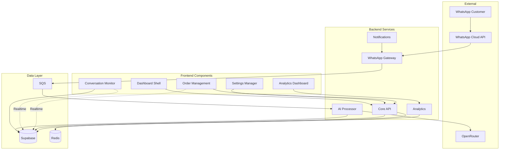

# Components

Based on the hybrid architecture with Python backend and TypeScript frontend, here are the major logical components across the fullstack.

## Backend Components (Python/FastAPI)

### WhatsApp Gateway Service
**Responsibility:** Manages all WhatsApp Cloud API interactions, webhook processing, and message queuing

**Key Interfaces:**
- `POST /webhooks/whatsapp` - Receive WhatsApp webhooks
- `send_message(phone, content, template)` - Send WhatsApp messages
- `validate_webhook(token, challenge)` - Webhook verification
- `process_media(media_id)` - Handle WhatsApp media downloads

**Dependencies:** WhatsApp Cloud API, Message Queue (SQS), Supabase

**Technology Stack:** FastAPI, httpx for async HTTP, python-whatsapp-business SDK, boto3 for SQS

### AI Processor Service
**Responsibility:** Handles all AI-powered conversation processing, sentiment analysis, and personality matching

**Key Interfaces:**
- `process_message(conversation_id, message)` - Process incoming message with AI
- `analyze_sentiment(text, language)` - Arabic-aware sentiment analysis
- `generate_response(context, personality)` - Generate contextual response
- `extract_intent(message)` - Identify user intent (feedback/order/support)

**Dependencies:** OpenRouter API, LangChain, Arabic NLP libraries (CAMeL Tools)

**Technology Stack:** FastAPI, LangChain, httpx, camel-tools, transformers

### Core API Service
**Responsibility:** Central business logic, restaurant management, and orchestration

**Key Interfaces:**
- `REST /restaurants/*` - Restaurant CRUD operations
- `REST /branches/*` - Branch management
- `REST /conversations/*` - Conversation management
- `authenticate_user()` - JWT validation with Supabase

**Dependencies:** Supabase (PostgreSQL + Auth), Redis Cache

**Technology Stack:** FastAPI, SQLAlchemy, supabase-py, redis-py

### Analytics Service
**Responsibility:** Real-time metrics processing, aggregation, and reporting

**Key Interfaces:**
- `calculate_metrics(restaurant_id, period)` - Generate dashboard metrics
- `process_feedback_analytics()` - Aggregate feedback sentiment
- `track_conversation_metrics()` - Response time, resolution rate
- `generate_reports()` - Scheduled report generation

**Dependencies:** Supabase, Pandas for data processing

**Technology Stack:** FastAPI, pandas, polars, apscheduler for cron jobs

### Notification Service
**Responsibility:** Alert management, escalation handling, and owner notifications

**Key Interfaces:**
- `send_escalation_alert(conversation_id, reason)` - Alert staff
- `notify_negative_feedback(feedback_id)` - Urgent alerts
- `send_daily_summary()` - Scheduled summaries
- `manage_alert_preferences()` - Per-user notification settings

**Dependencies:** WhatsApp Gateway (for WhatsApp alerts), SMTP/SendGrid

**Technology Stack:** FastAPI, celery for async tasks, sendgrid SDK

## Frontend Components (TypeScript/Next.js)

### Dashboard Shell
**Responsibility:** Main application layout, navigation, and authentication wrapper

**Key Interfaces:**
- `<AuthProvider>` - Supabase auth context
- `<NavigationMenu>` - Multi-branch navigation
- `<NotificationCenter>` - Real-time alerts
- `useRestaurant()` - Restaurant context hook

**Dependencies:** Supabase Auth, Zustand store

**Technology Stack:** Next.js App Router, Supabase JS Client, Zustand

### Conversation Monitor
**Responsibility:** Real-time conversation viewing and intervention interface

**Key Interfaces:**
- `<ConversationList>` - Filterable conversation list
- `<ConversationView>` - Message thread display
- `<InterventionPanel>` - Manual message sending
- `useRealtimeConversations()` - WebSocket subscription hook

**Dependencies:** Supabase Realtime, Core API

**Technology Stack:** React, Supabase Realtime Client, Tanstack Query

### Analytics Dashboard
**Responsibility:** Metrics visualization, trend analysis, and reporting

**Key Interfaces:**
- `<MetricsGrid>` - Key performance indicators
- `<SatisfactionChart>` - Rating trends
- `<BranchComparison>` - Multi-location analytics
- `<ReportGenerator>` - Export functionality

**Dependencies:** Analytics API, Chart libraries

**Technology Stack:** React, Recharts/Tremor, react-pdf for exports

## Component Interaction Diagram

