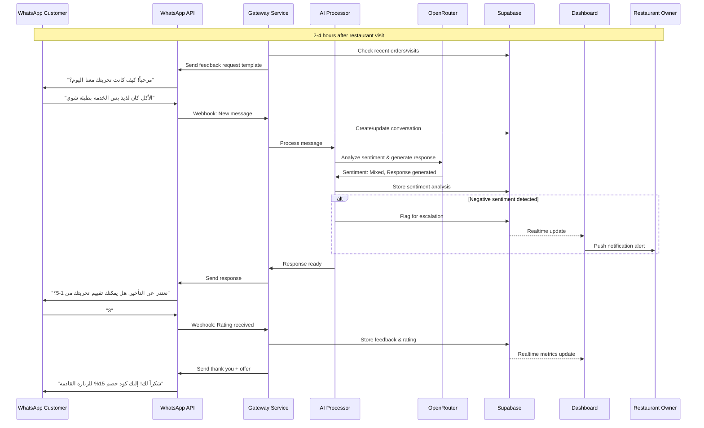
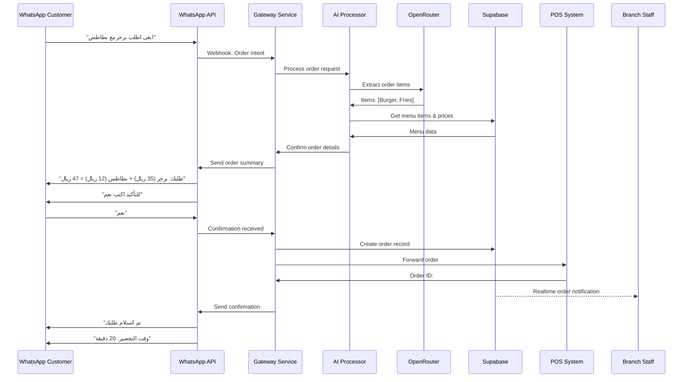
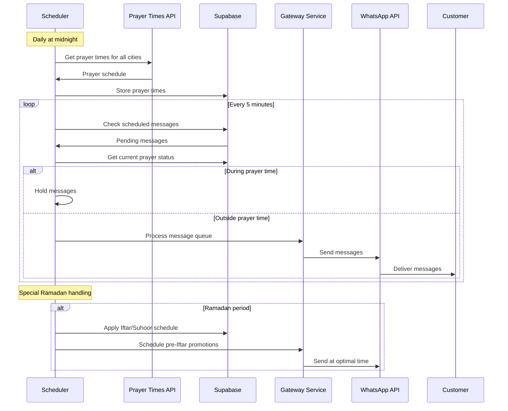

# Core Workflows

## Customer Feedback Collection Workflow

```mermaid
sequenceDiagram
    participant C as WhatsApp Customer
    participant WA as WhatsApp API
    participant GW as Gateway Service
    participant AI as AI Processor
    participant OR as OpenRouter
    participant DB as Supabase
    participant DASH as Dashboard
    participant O as Restaurant Owner

    Note over C,O: 2-4 hours after restaurant visit
    
    GW->>DB: Check recent orders/visits
    GW->>WA: Send feedback request template
    WA->>C: "مرحباً! كيف كانت تجربتك معنا اليوم؟"
    
    C->>WA: "الأكل كان لذيذ بس الخدمة بطيئة شوي"
    WA->>GW: Webhook: New message
    GW->>DB: Create/update conversation
    GW->>AI: Process message
    
    AI->>OR: Analyze sentiment & generate response
    OR->>AI: Sentiment: Mixed, Response generated
    AI->>DB: Store sentiment analysis
    
    alt Negative sentiment detected
        AI->>DB: Flag for escalation
        DB-->>DASH: Realtime update
        DASH->>O: Push notification alert
    end
    
    AI->>GW: Response ready
    GW->>WA: Send response
    WA->>C: "نعتذر عن التأخير. هل يمكنك تقييم تجربتك من 1-5؟"
    
    C->>WA: "3"
    WA->>GW: Webhook: Rating received
    GW->>DB: Store feedback & rating
    DB-->>DASH: Realtime metrics update
    
    GW->>WA: Send thank you + offer
    WA->>C: "شكراً لك! إليك كود خصم 15% للزيارة القادمة"
```

## Order Placement Workflow

```mermaid
sequenceDiagram
    participant C as WhatsApp Customer
    participant WA as WhatsApp API
    participant GW as Gateway Service
    participant AI as AI Processor
    participant OR as OpenRouter
    participant DB as Supabase
    participant POS as POS System
    participant B as Branch Staff
    
    C->>WA: "ابغى اطلب برجر مع بطاطس"
    WA->>GW: Webhook: Order intent
    GW->>AI: Process order request
    
    AI->>OR: Extract order items
    OR->>AI: Items: [Burger, Fries]
    
    AI->>DB: Get menu items & prices
    DB->>AI: Menu data
    
    AI->>GW: Confirm order details
    GW->>WA: Send order summary
    WA->>C: "طلبك: برجر (35 ريال) + بطاطس (12 ريال) = 47 ريال"
    WA->>C: "للتأكيد اكتب نعم"
    
    C->>WA: "نعم"
    WA->>GW: Confirmation received
    
    GW->>DB: Create order record
    GW->>POS: Forward order
    POS->>GW: Order ID: #1234
    
    DB-->>B: Realtime order notification
    
    GW->>WA: Send confirmation
    WA->>C: "تم استلام طلبك #1234"
    WA->>C: "وقت التحضير: 20 دقيقة"
```

## Prayer Time Aware Scheduling

```mermaid
sequenceDiagram
    participant SCHED as Scheduler
    participant PT as Prayer Times API
    participant DB as Supabase
    participant GW as Gateway Service
    participant WA as WhatsApp API
    participant C as Customer
    
    Note over SCHED: Daily at midnight
    
    SCHED->>PT: Get prayer times for all cities
    PT->>SCHED: Prayer schedule
    SCHED->>DB: Store prayer times
    
    loop Every 5 minutes
        SCHED->>DB: Check scheduled messages
        DB->>SCHED: Pending messages
        
        SCHED->>DB: Get current prayer status
        
        alt During prayer time
            SCHED->>SCHED: Hold messages
        else Outside prayer time
            SCHED->>GW: Process message queue
            GW->>WA: Send messages
            WA->>C: Deliver messages
        end
    end
    
    Note over SCHED: Special Ramadan handling
    
    alt Ramadan period
        SCHED->>DB: Apply Iftar/Suhoor schedule
        SCHED->>GW: Schedule pre-Iftar promotions
        GW->>WA: Send at optimal time
    end
```
