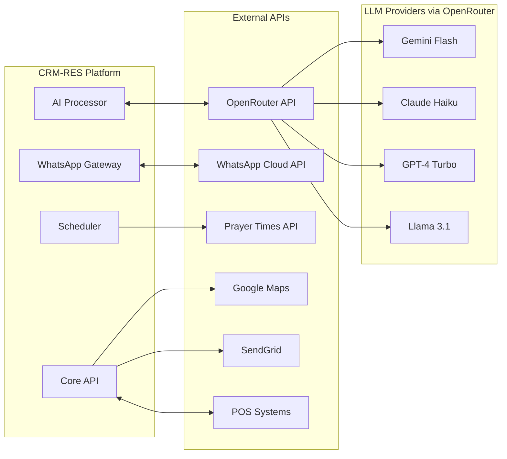

# External APIs

## OpenRouter API (LLM Gateway)
- **Purpose:** Unified access to multiple LLM providers for conversation processing and Arabic language understanding
- **Documentation:** https://openrouter.ai/docs
- **Base URL(s):** https://openrouter.ai/api/v1
- **Authentication:** Bearer token (API Key with "Bearer" prefix)
- **Rate Limits:** Depends on selected model and account tier

**Key Endpoints Used:**
- `POST /chat/completions` - Generate conversational responses with model selection
- `GET /models` - List available models and pricing
- `POST /generation` - Streaming responses for lower latency
- `GET /limits` - Check current usage and rate limits

**Model Selection Strategy:**
- **Primary:** `google/gemini-flash-1.5` - Fast, cost-effective for Arabic
- **Fallback 1:** `anthropic/claude-3-haiku` - High quality, good Arabic support
- **Fallback 2:** `meta-llama/llama-3.1-70b-instruct` - Open source option
- **Premium:** `openai/gpt-4-turbo` - For complex conversations requiring escalation

**Integration Notes:** 
- OpenRouter handles failover between providers automatically
- Supports custom routing rules based on cost/latency/quality preferences  
- Arabic-optimized prompt templates stored in configuration
- Context window varies by model (8k-128k tokens)
- Streaming responses reduce perceived latency for customers
- Usage tracking and cost optimization built into OpenRouter dashboard

## WhatsApp Business Cloud API
- **Purpose:** Core messaging platform for all customer interactions
- **Documentation:** https://developers.facebook.com/docs/whatsapp/cloud-api
- **Base URL(s):** https://graph.facebook.com/v19.0/{phone_number_id}
- **Authentication:** Bearer token (System User Access Token)
- **Rate Limits:** 80 messages/second (business initiated), 1000 messages/second (user initiated)

**Key Endpoints Used:**
- `POST /messages` - Send text, template, and interactive messages
- `POST /media/{media_id}` - Download received media files
- `GET /phone_numbers` - Verify business phone number status
- `POST /messages/templates` - Send template messages for initial contact

**Integration Notes:** Webhook verification required on setup. Must handle status callbacks for delivery confirmation. Prayer time awareness implemented in message scheduling layer.

## Supabase Platform APIs
- **Purpose:** Database, authentication, realtime subscriptions, and storage
- **Documentation:** https://supabase.com/docs/reference
- **Base URL(s):** https://{project_ref}.supabase.co
- **Authentication:** Service role key for backend, anon key for frontend
- **Rate Limits:** Based on plan (Free: 500 concurrent connections, Pro: 5000)

**Key Endpoints Used:**
- `POST /auth/v1/token` - User authentication
- `POST /rest/v1/{table}` - Database operations via PostgREST
- `WebSocket /realtime/v1/websocket` - Realtime subscriptions
- `POST /storage/v1/object/{bucket}` - Media file storage

**Integration Notes:** Row Level Security policies enforce multi-tenancy. Realtime requires heartbeat every 30 seconds. Edge Functions available for complex database triggers.

## Saudi Prayer Times API
- **Purpose:** Accurate prayer times for message scheduling
- **Documentation:** https://aladhan.com/prayer-times-api
- **Base URL(s):** https://api.aladhan.com/v1
- **Authentication:** None required (public API)
- **Rate Limits:** 14000 requests/day

**Key Endpoints Used:**
- `GET /timingsByCity` - Get prayer times by Saudi city
- `GET /hijriCalendarByCity` - Get Hijri calendar for Ramadan detection

**Integration Notes:** Cache prayer times daily per city. Add 10-minute buffer before and after prayer times. Special handling for Ramadan schedule adjustments.

## Integration Architecture with OpenRouter

